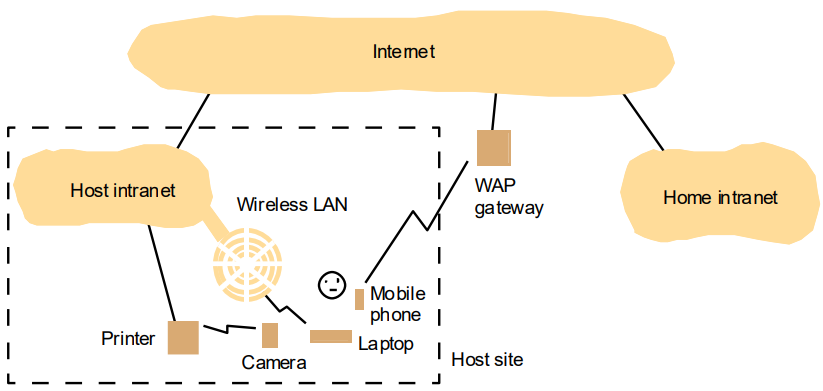

# Aula 1

## Sistema distribuído

### Definição
Conjunto de computadores independentes, interligados por uma rede de comunicação, que compartilham recursos e trocam informações.

### Características
Algumas das principais características de um sistema distribuído são:
 - Comunicação por mensagens;
 - Sistema assíncrono (não é em simultâneo);
 - Concorrência (vários processos podem estar a executar em simultâneo);
 - Partilha de recursos;

### Intranet
Rede de computadores que se comunicam via um modo de comunicação privado, ou seja, não é aberto ao público.

*Figura 1 - Intranet*

### Computação Móvel e Ubíqua
- **Computação Móvel**: Computadores que se movem de um lugar para outro:
   - Exemplo: Computadores portáteis, telemóveis, etc.;
- **Computação Ubíqua**: Sistemas cuja utilização está de tal forma integrada na funcionalidade do produto transparente para o utilizador;
- **Sistemas embebidos**: Computadores que estão em outros dispositivos:
   - Exemplo: Computadores em televisões eletrodomésticos, etc.;

### Desafios na implementação de sistemas distribuídos
Alguns dos desafios na implementação de sistemas distribuídos são:
 - **Escabilidade**: Capacidade de um sistema de se adaptar a um aumento de carga de trabalho;
 - **Tolerância a falhas**: Capacidade de um sistema de continuar a funcionar mesmo que ocorra uma falha (mascarando/tolerando a falha);
 - **Segurança**: Garantir que os dados e as aplicações estão protegidos (tanto a sua integridade como a sua confidencialidade);
 - **Transparência**: Capacidade de um sistema de esconder a complexidade da sua implementação;

### Exemplos de transparência na implementação de sistemas distribuídos
Alguns exemplos de transparência são:
 - **Transparência de acesso**: - acesso a recursos locais e a recursos remotos seja feito através das mesmas operações;
 - **Transparência de localização**: - permite que os recursos possam ser acedidos sem o conhecimento da sua localização;
 - **Transparência de concorrência**: - permite que os recursos possam ser acedidos sem o conhecimento da sua concorrência;
 - **Transparência de replicação**: - permite que os recursos possam ser acedidos sem o conhecimento da sua replicação (se o recurso está replicado ou se é o original);

# Resolução dos exercícios da aula 1
1. Dê exemplos de recursos partilhados por sistemas distribuídos:
   R: Armazenamento e processamento de dados, base de dados, serviços de rede, recursos de comunicação.
2. Cada recurso disponibilizado na Web é identificado por um URL (Uniform Resource Locator). Em que medida um URL tem transparência de localização?
   R: O URL tem um mecanismo que determina a localização baseada no nome
3. Usar a Web para ilustrar o conceito de cliente/servidor.
   R: Na Web, os navegadores são os clientes que solicitam recursos aos servidores web. Os servidores web são responsáveis por fornecer os recursos solicitados, como páginas da web e arquivos, em resposta às solicitações dos clientes. A comunicação entre cliente e servidor é realizada através do protocolo HTTP. Os clientes enviam solicitações e os servidores respondem com os recursos solicitados.
4. Suponhamos um programa servidor escrito numa linguagem (C++ por exemplo) que implementa um dado objecto, XPTO, que se pretende que possa ser acedido por clientes escritos numa outra linguagem (Java por exemplo). Os computadores cliente e servidor podem ter hardware diferente, mas todos estão ligados a uma internet. Que problemas de heterogeneidade será necessário resolver para que um objecto cliente possa invocar um método no objecto servidor?
   R: Problemas de heterogeneidade de sistemas operativos e linguagens de programação. Estes são resolvidos através do *middleware*
5. Suponha-se que as operações do objecto XPTO são separadas em duas categorias: operações públicas, disponíveis para todos os utilizadores, e operações protegidas disponíveis apenas para certos utilizadores. Quais os problemas que se colocam para assegurarmos que apenas alguns dos utilizadores podem aceder a uma operação protegida?
   R: Manter o nível de confidencialidade exigido pelos utilizadores, garantir a integridade (alteração ou corrupção) dos dados, manter a disponibilidade do sistema. Ataques do tipo “negação de serviço” (DoS).
6. Quando um cliente invoca um método num objecto servidor quais os principais componentes de software que podem falhar? (Dar um exemplo de uma falha para cada caso)
   R: Falhas na rede, como perda de mensagens, duplicação e reordenação. Falhas no nó destino, como validação inadequada de entrada, problemas de concorrência e exceções não tratadas.
7. Suponhamos um processo servidor que contém um objecto com informação partilhada por vários clientes. Dar argumentos pró e contra permitir que o servidor execute concorrentemente os pedidos dos vários clientes.
   R: Prós: Maior escalabilidade, Melhor utilização de recursos, Melhor desempenho. Contras: Concorrência introduz complexidade, Sincronização e gerenciamento de recursos.
